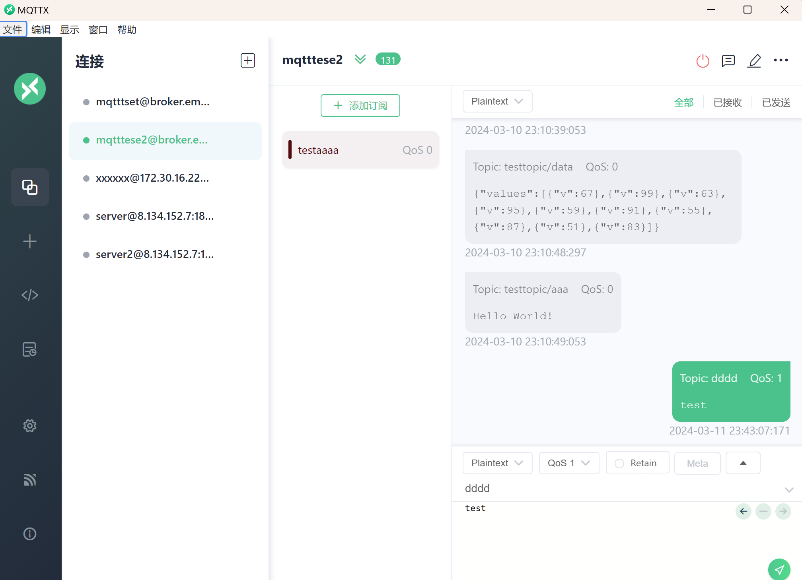

# ToyMQTT

## 项目简介

大家好，这是我耗时两个月写的玩具MQTT项目，主要实现的是MQTT3.1，写这个主要是为了了解MQTT协议，也是为了“复习" 网络编程，相对于烂大街的HTTP服务器，我觉得MQTT更新颖，也更具挑战性。虽说是玩具，但麻雀虽小五脏俱全，里面用到了IO多路复用(epoll方式)、实现了 一个简单的线程池，当然最重要的是协议报文的封装和解析，没有使用用任何第三方库，从零解析。实现报文解析的代码主要在protocol.cpp这个文件，实现封装的解析主要在client.cpp这个文件，由client.cpp编译出来的可执行文件(toymqtt-client)即是一个MQTT客户端。由于时间有限，暂时只支持Linux，并且肯定会有一些bug。如果你们有兴趣看的话发现bug也可以提出，或修改。

### 源码文件功能说明

<mark>main.cpp</mark>: 服务端入口代码(main函数)

<mark>object.cpp</mark>: 服务端代码依赖的类和结构

<mark>configuration.cpp</mark>: 读取配置文件的实现

<mark>protocol.cpp</mark>：协议解析

<mark>threadpool.cpp</mark>：线程池的实现

client子目录:  协议报文的封装及客户端实现

### 编译

服务端的编译，在主目录下执行make命令即可，可执行文件会编译到当前路径。

客户端的编译，客户端的子目录下也有个Makefile, 执行make命令即可

### 使用说明

#### 服务端

服务端可以使用命令行参数启动，不过暂时只支持地址和端口，其余配置使用默认，如果想要设置更多参数，请使用配置文件，默认的配置文件会读取/etc/toymqtt/toymqtt.conf，也可以使用命令toymqtt [指定配置文件路径]，以下是配置项的说明：

listen = 服务端监听的地址

port = 服务端监听的端口

qos1_wait_time = qos1未收到回复时等待的时间，到时重新发送

qos2_wait_time = qos2未收到回复时等待的时间，到时重新发送

max_thread_num = 线程池最大线程数

min_thread_num = 线程池最小线程数

task_queque_size  = 任务队列长度

#### 客户端

客户端使用命令行参数配置启动，以下是各参数说明：

```shell
Usage: toymqtt-client [OPTIONS]... to connect to broker  

                        -b, --broker addr(required)      #服务端地址

                        -p, --broker port(required)      # 服务端端口

                        -c, --client id(required)        # 客户端ID，可随意指定

                        -C, --with no clean session      # 如果打开此选项，则保留session，默认不保留(非必须)

                        -k, --keep alive                 # 客户端心跳检测，每隔多少秒向客户端发送ping请求(非必须)

                        -u, --user name                  # 用户名(非必须)

                        -P, --password                   # 密码(非必须)

                        Examples:                        #以下是例子

                       toymqtt-client -b 127.0.0.1 -p 1833 -c test -C -k 60 -u username -p password\n\

                       toymqtt-client -b 127.0.0.1 -p 1833 -c test\n";


```

调试用的可视化客户端推荐使用[MQTTX: Your All-in-one MQTT Client Toolbox](https://mqttx.app/)

该客户端具有较友好的界面：



## MQTT简介

MQTT（Message Queuing Telemetry Transport，消息队列遥测传输协议），是一种基于发布/订阅（publish/subscribe）模式的轻量级通讯协议，该协议运行于TCP/IP上，故该协议工作于应用层，属于应用层协议。由IBM在1999年发布，现已广泛使用于IoT(物联网)领域。


MQTT协议的优点，官方的解释是：用极少的代码和有限的带宽，为连接远程设备提供实时可靠的消息服务；简单理解就是，实现起来简单（实际上我觉得并不简单，至少实现起来是比http要复杂的，不过占用资源确实是比http要小，主要它的控制报文比较小），并且在传输上无效的数据也很少，而且能够保证数据传输的可靠性。由于是发布-订阅模式的通信方式，服务端被称为代理者(Broker), 客户端则被成为订阅者(Subscriber), 订阅者到订阅者的通信需要由代理者来中转，所以这些角色是相对的，比如某个客户端A发送消息到服务端，此时服务端是接收方，而服务端需要根据此消息的主题再转发给此主题的订阅者，那么服务端在转发的过程就是发送方，订阅者就是接收方。


## MQTT报文结构


MQTT的每个操作(连接、订阅、取消订阅、发布、Ping、断开连接)都有不同的报文结构，但是每个报文都有固定头(Fixed header) ，有部分的报文有可变头(Variable header)和负载(Payload)，负载就是除了控制信息以外的有效载荷，类似http中实际的html内容，让我们先了解"固定"和"可变"的概念。

例如，客户端请求连接的报文如下：


上图中，控制码(消息类型码)和剩余长度共同组成了请求连接的固定头，那么除了共同组成可变头的两个字节，剩下的内容都是可变头的内容，因为请求连接不需要携带载荷，所以连接报文仅由固定头+可变头组成。可变头中包含的依然是报文的控制信息，但是有些字段的长度不是固定的，例如上图中的Client ID和UserName和Password长度就是不固定的，所以它们还分别用了Client ID Length、 UserName Length、Password Length来标识它们的长度，这样服务端就知道应该从哪里开始取字段值，以及取多少字节，所以称为可变头。具体的字段含义如下表：


| 字段                   | 含义                                              | 大小(字节) |
|:--------------------:|:-----------------------------------------------:|:------:|
| Protocol Name Length | 协议名称，固定为”MQTT“                                  | 4      |
| Version              | MQTT版本                                          | 1      |
| Connect Flags        | 连接标志，包含了一些控制信息，详见下图表                            | 1      |
| Keep Alive           | 存活时间(单位秒)，服务端根据此时间判断客户端是否在线，此时间内客户端没有任何请求会被认为离线 | 2      |
| Client ID Length     | 客户端ID长度                                         | 2      |
| Client ID            | 客户端ID具体内容                                       | x      |
| User Name Length     | 用户名长度                                           | 2      |
| User Name            | 用户名具体内容                                         | x      |
| Password Length      | 密码长度                                            | 2      |
| Password             | 密码具体内容                                          | x      |

Connect Flags 虽然只有1字节，但却包含了多项重要的控制信息：


| 位      | 7       | 6      | 5      | 4    | 3    | 2        | 1      | 0    |
|:------:|:-------:|:------:|:------:|:----:|:----:|:--------:|:------:|:----:|
| **含义** | 是否携带用户名 | 是否携带密码 | 遗嘱消息保留 | QoS1 | QoS0 | 是否设置遗嘱消息 | 是否清除会话 | 固定为0 |

为了理解上表所标识的含义，首先要了解MQTT的几个重要特性：

**遗嘱机制**：MQTT客户端由于某种原因与服务端断开连接后(非正常请求断开连接) 需要发布的消息，客户端可以设置遗嘱消息，可以发布到指定主题，在异常断开连接后由服务端发布此消息，可用于通知其它订阅者该客户端(发布者)已异常断线，各订阅者可执行相应的动作。特别注意，如果连接标志的第2位被设置为1，则遗嘱主题和遗嘱消息内容需要加在可变头中。

**遗嘱保留**：当服务端发布了遗嘱消息后是是否保留，如果不保留，则发布完成后此遗嘱消息将从服务端删除。

**清除会话**(Clean Session) :  当客户端断线后(不论是否正常请求断开)，是否恢复会话，在断线期间接收到订阅的主题的消息是否接收(恢复)。

**QoS服务质量**：MQTT中使用QoS机制保证消息传递的可靠性，可以说是MQTT中最重要的特性。MQTT共设计了3个QoS等级：

- QoS 0：消息从发送方到接收方最多传递一次，如果接收方接收失败也不会重新发送。

- QoS 1:  消息从发送方到接收方最少传递一次，发送方发送后，接收方收到必须回复一个PUBACK消息，否则会一直重复发，直到收到PUBACK为止。

- QoS 2：通过两次会话保证消息只传递1次，这是最高等级的QoS, 但也是网络消耗最大的，当发送方向接收方发布了一条QoS 2的消息，会将发布的消息(ID)存储起来，等待接收方的PUBREC回复，当收到PUBREC消息后就会删除之前保存的消息，因为此时确认接收方已经接收到消息，最后再发送一个PUBREL消息给接收方确认一次，接收方会回复一个PUBCOMP消息，这样就完成一次QoS 2通信。
  
  

**QoS降级**：订阅者在订阅某个主题时，会设置接收此主题的QoS等级，标识了服务端在向自己发送此主题的消息时可以使用的最高QoS等级, 假设某订阅者A订阅某主题时设定的QoS为1，而另一个客户端B向服务端发送此主题的一条消息的QoS等级为2，当服务端转发此消息到A时，只能使用等级为1的QoS, 也就是要重新设置报文里的QoS等级，这种现象叫做QoS降级。


再来看发布消息的报文结构：


上图中，向服务端发送了一条内容为”test“的消息，那么”test“就是这条发布消息的负载(Payload)，而且它前面依然包含了固定头的消息类型码和剩余长度，以及包含主题长度(Topic Legth)、主题名称和消息ID(Message Identifier)的可变头, 但发布消息的控制码既指定了消息类型，还包含了一些控制信息，这些信息如下表：


| 位   | 7     | 6     | 5     | 4     | 3         | 2     | 1     | 0    |
| --- |:-----:|:-----:|:-----:|:-----:|:---------:|:-----:|:-----:|:----:|
| 含义  | 消息类型3 | 消息类型2 | 消息类型1 | 消息类型0 | 重复标志(DUP) | QoS 1 | QoS 0 | 固定为0 |

可以看到消息类型共占4位，QoS共占2位，重复标志则标识该条消息是否是重复发送的。

MQTT总共包含如下的类型码：

上述表格的4-7位：


上上述表格的0-3位：


再例如下图的PING报文，就只包含了固定头：


关于MQTT的简介就到此，更多详细内容请参阅官方文档：[MQTT Version 3.1.1 (oasis-open.org)](https://docs.oasis-open.org/mqtt/mqtt/v3.1.1/os/mqtt-v3.1.1-os.html#_Toc398718037)


